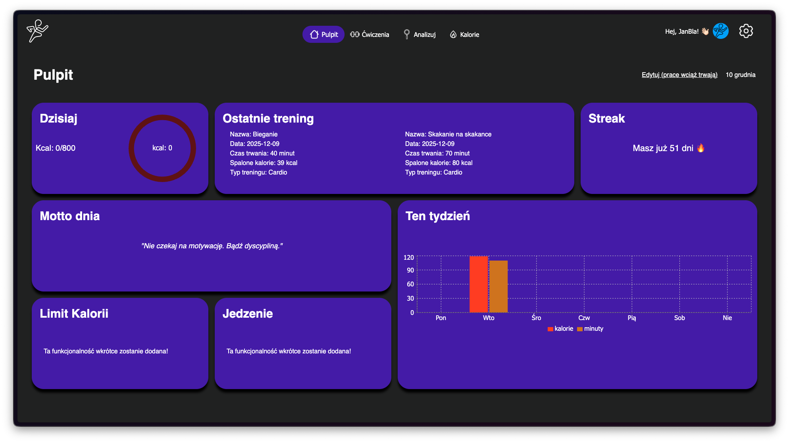
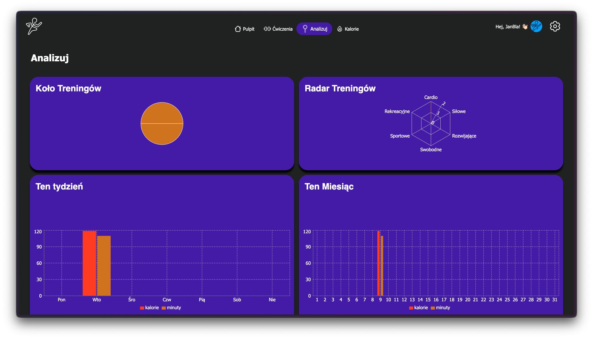

# Fittrack
> **Czas spędzony nad projektem:** ~73h

## Krótki opis
FitTrack to prosty front-end aplikacji śledzącej aktywność fizyczną (React + TypeScript + Vite). Aplikacja prezentuje pulpit użytkownika z widgetami, stronę główną z bannerem/promocją, ekran ćwiczeń oraz formularze logowania/rejestracji/resetu hasła.

## Screenshots
- 
- 

## Video demo
- WIDEO 

## Funkcjonalności
- Strona główna z bannerem i sekcjami Discover i Pricing
- Formularze: logowanie, rejestracja, reset hasła (z walidacją)
- Dashboard z widgetami (siatka 4x3 na desktopie) ( siatka 2x6 na urządzeniach mobilnych)
- Responsywne komponenty (desktop / tablet / mobile)
- Theme (ciemny / jasny) z globalnymi klasami
- Prosty system widgetów (przykładowe widgety)

### Krótki przewodnik po frontendzie aplikacji FitTrack.

## Struktura projektu

Zobacz `docs/structure.md` dla szczegółowego opisu struktury projektu i lokalizacji ważnych plików.

Przydatne pliki

- `src/global.css` — globalne utility (przyciski, rounded, shadow)
- `src/hooks/` — niestandardowe hooki (np. `useLoginForm`, `useRegisterForm`)
- `src/reducers/` — reducery (np. `registerFormReducer`)
- `src/components/` — komponenty aplikacji (atoms/molecules/organisms/templates)

Pełna dokumentacja znajduje się w folderze `docs/`.

## Szybki start
1. Sklonuj repozytorium
```bash
git clone https://github.com/Teczak-dev/fittrack-frontend.git
cd fittrack-frontend
```
2. Zainstaluj zależności
```bash
npm install
```
3. Uruchom w trybie deweloperskim
```bash
npm run dev
```
4. Otwórz w przeglądarce (Vite poda URL, zwykle `http://localhost:5173`)

## Budowanie produkcyjne
```bash
npm run build
npm run preview
```

## Konfiguracja
- Projekt nie wymaga kluczy API w tym repo, API jest prywatnym projektem, dostęp do backendu możliwy po kontakcie prywatnym 

- Wyjasnienie endpointów API znajdują się w `docs/api.md`

## Struktura projektu (krótko)
- `src/` — kod źródłowy
  - `components/` — atoms/molecules/organisms/templates
  - `context/` — React Contexts (Theme, Workouts itp.)
  - `hooks/` — custom hooks (`useRegisterForm`, `useLoginForm`)
  - `reducers/` — reducer-y (np. `registerFormReducer`)
  - `utils/` — helpery i walidacja
  - `assets/` — obrazy i zasoby publiczne

Pełna dokumentacja znajduje się w katalogu `docs/structure`.

## Biblioteki (wybrane)
- React + TypeScript — bezpieczny, typowany front-end
- Vite — szybki bundler i dev server
- react-router-dom — routowanie 

## Known issues
Spis znanych problemów w `docs/known_issues.md`.

## Architektura i komponenty
- Diagram architektury i opis kluczowych komponentów: `docs/architecture.md` i `docs/components.md`.

## Co sprawiło trudność
- Krótkie omówienie problemów i rozwiązań: `docs/adr.md`.

## Contribution
- Instrukcja dodawania funkcjonalności: `docs/contribution.md`.

## Live demo
- https://mikolaj-sobczak.pl/app/fittrack/

## Licencja
Sprawdź plik `LICENSE` w repozytorium.

---

## 👨‍💻 Autor

**Mikołaj Sobczak** - [@Teczak-dev](https://github.com/Teczak-dev)

- 🌐 **Website:** [mikolaj-sobczak.pl](https://mikolaj-sobczak.pl/)
- 💼 **LinkedIn:** [Mikołaj Sobczak](https://www.linkedin.com/in/mikołaj-sobczak-27b0a429a)
- 📧 **Contact:** poprzez GitHub Issues

---

*Projekt stworzony w celach edukacyjnych jako demonstracja nowoczesnych technik frontend development.*
